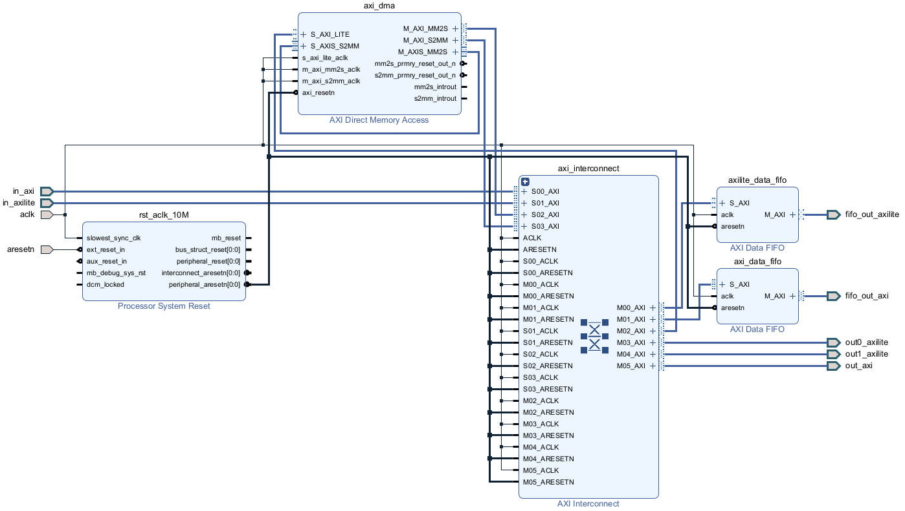

## Test de la plateforme de simulation
Elle est décrite au point 2.2 du DTN-TVO-ET.

### AXI DMA
Pour le moment, ce test est principalement à propos de l'IP AXI DMA de Xilinx.
Les registres du DMA doivent être écrit en little endian mais le framework ne support que le big endian pour le moment
    -> la conversion little -> big endian est faite à la main dans les fichiers de data (dma\_write.dat and dma\_read.dat)

Cette IP a les interfaces suivantes:
- S\_AXI\_LITE qui permet de la controller
- S\_AXIS\_S2MM qui permet de recevoir des données
- M\_AXI\_MM2S qui permet de lire des données à une addresse
- M\_AXI\_S2MM qui permet d'écrire des données à une addresse
- M\_AXIS\_MM2S qui permet d'envoyer des données

Ici, les bus AXI-Stream sont connectés ensemble ce qui permet d'utiliser cette IP pour transporter des données entre
deux espaces addressés (les interfaces AXI-Stream deviennent "interne" à l'IP).

#### Déroulement de la simulation
Le maître AXI master\_in\[0\] commence par écrire dans la ram\_out\[0\] des données.  
Ensuite, le maître AXI master\_in\[1\] écrit dans les registres du DMA afin de lire une portion de ram\_out\[0\]
(voir inputs/dma\_read.txt).
Ensuite, encore avec le master\_in\[1\], on fait une opération très similaire en commandant le DMA d'écrire ces données
dans ram\_out\[1\] (voir inputs/dma\_write.txt).

A la fin de la simulation, on print les données contenues dans ces deux ram et on peut voir qu'elles sont identiques.
On pourrait aussi les écrire dans un fichier ou les comparer dans le script python, c'est un objet framework.DataList.

